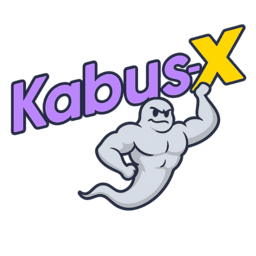
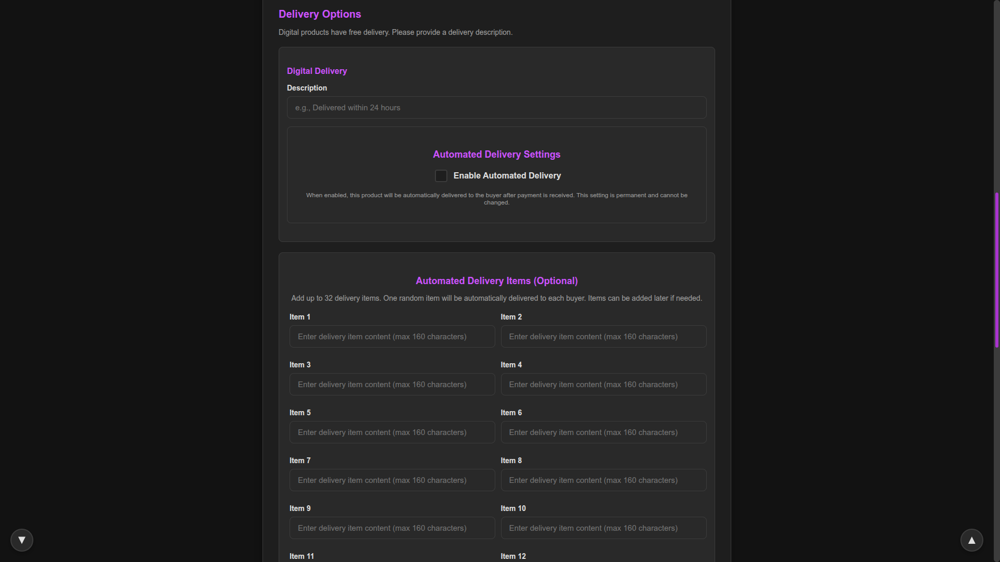
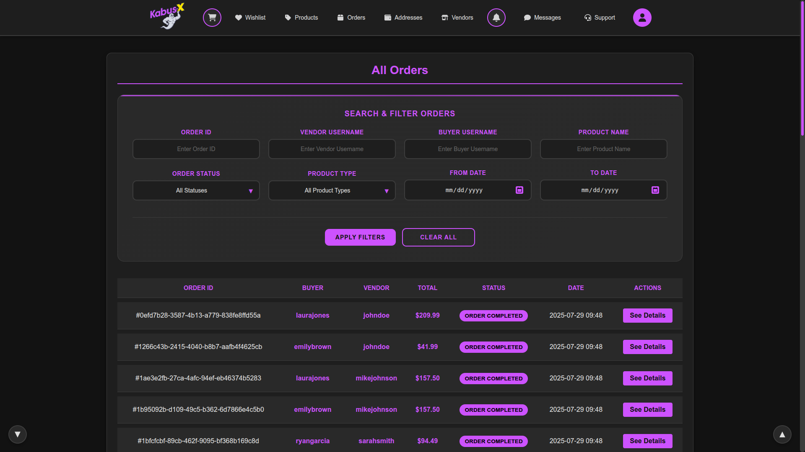
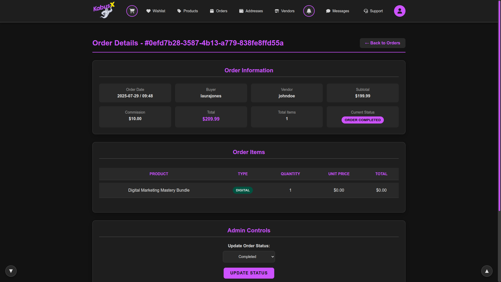
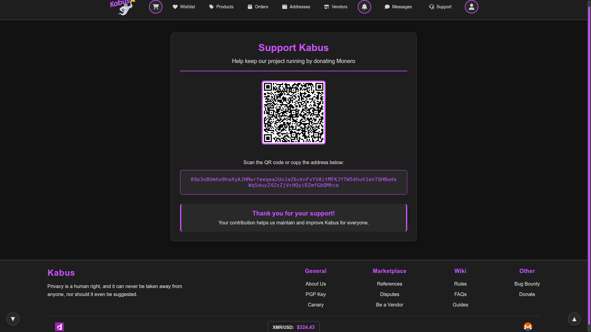
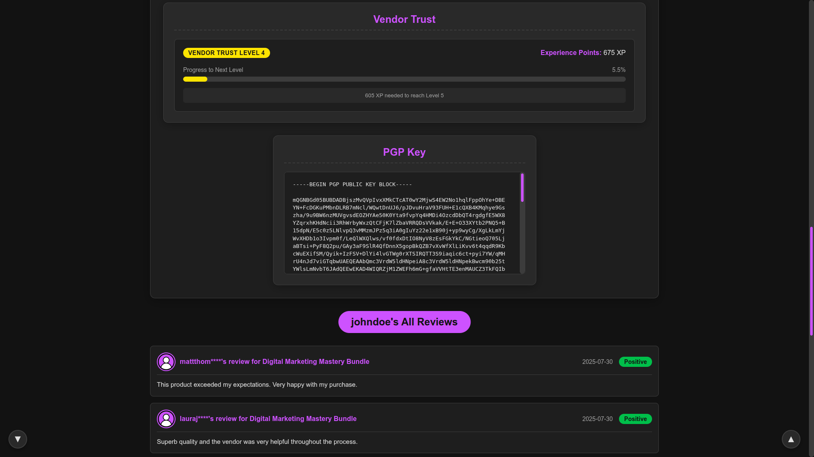

# What is Kabus-X?

Kabus-X is a premium and custom version of Kabus, designed for high-end users who are willing to pay for enhanced features and advanced functionality.

# [Development History](COMMIT-HISTORY.md)

# Kabus-X Development To-Do List
- ✅ Vendor Trust System - Rating system for vendors
- ✅ Queue-Based Order System - Efficient order processing
- ⬜ Custom Session Timer for Login - Adaptive session management
- ✅ Auto Delivery for Digital Products - Instant digital delivery
- ⬜ Image Feedback from Vendors for Dead Drop Orders - Photo proof system
- ⬜ Site-Wide Markdown Support - Markdown in all content areas
- ⬜ Laravel 12 Upgrade - Framework migration
- ⬜ Auto Jabber Notifications for Vendors - Real-time notifications
- ⬜ Better Admin Control - Enhanced admin panel
- ✅ New UI with No Sidebars - Clean, modern interface
- ⬜ Integrated Anti-Phishing Page - Onion address verification system
- ✅ Separate Admin Layout - Dedicated administrative interface
- ✅ Separate Vendor Layout - Dedicated vendor management interface
- ⬜ Mobile Responsive Design - Optimized mobile experience
- ⬜ Secure Hidden Service Guide - OPSEC documentation

---

### Screenshots

---

---

---

---

---

## Contact Information

**Session Contact:** `051a9c0bd47481ed45165903ad3e1c8ca27ae7a9e3c90dbbd61aa96337ea6aba27`

**Signal Link:** `https://signal.me/#eu/TBPdPWJBWmx3ElMMIX0DqeZ1ykyMEOjcwK8GHgF2oNEw-0-l5pVFyKo1adqsEznA`

---

## Payment Address

**Monero (XMR)** `89p3o8Umho9haXyAJHMwrfeeqea2UoJaZ6sknFvYVAitMFKJYTW54huh1enTQHBwdaWq5duyZ4ZsZjVcHQyiRZmfGbQMhce`

