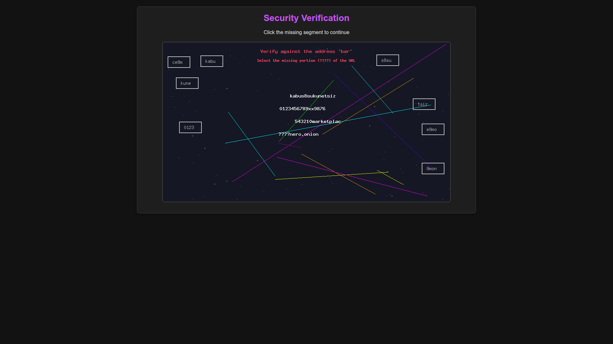
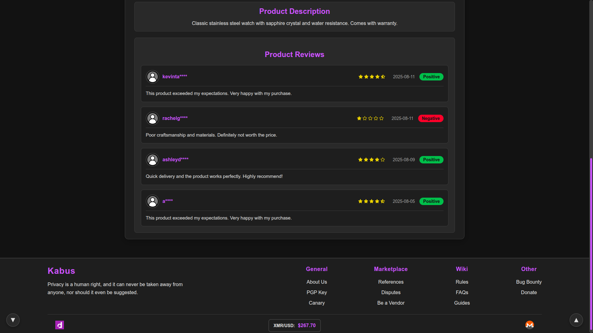
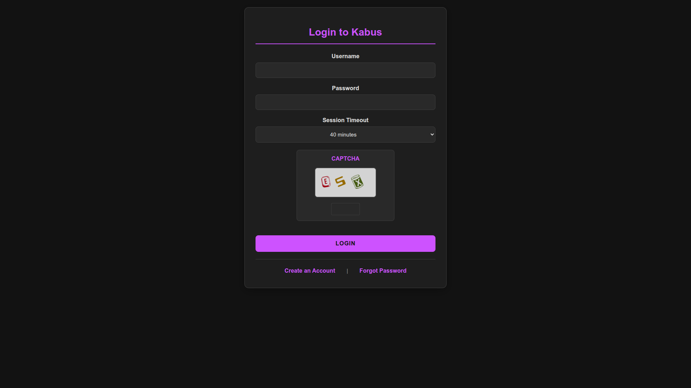
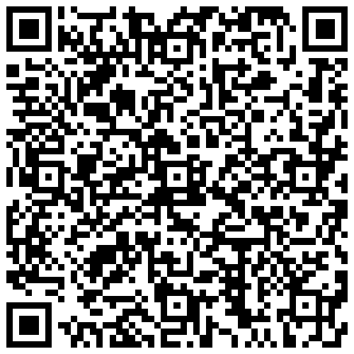

# What is Kabus-X?

Kabus-X is a premium and custom version of Kabus, designed for high-end users who are willing to pay for enhanced features and advanced functionality.

# [Development History](COMMIT-HISTORY.md)

- ✅ Vendor Trust System - Rating system for vendors
- ✅ Queue-Based Order System - Efficient order processing
- ✅ Custom Session Timer for Login - Adaptive session management
- ✅ Auto Delivery for Digital Products - Instant digital delivery
- ✅ Image Feedback from Vendors for Dead Drop Orders - Photo proof system
- ✅ Laravel 12 Upgrade - Framework migration
- ✅ Enhanced Security Headers - Advanced security implementation with bepsvpt/secure-headers
- ✅ Fiat Price Display - Real-time fiat currency conversion for Monero payments
- ⬜ Auto XMPP Notifications for Vendors - Real-time notifications
- ✅ Order Management in Admin Panel - Complete order oversight for administrators
- ✅ Order & Dispute Statistics in Admin Panel - Real-time analytics and reporting
- ✅ New UI with No Sidebars - Clean, modern interface
- ✅ Integrated Anti-Phishing Page (Optional) - Onion address verification system
- ✅ Separate Admin Layout - Dedicated administrative interface
- ✅ Separate Vendor Layout - Dedicated vendor management interface
- ⬜ Mobile Responsive Design - Optimized mobile experience
- ✅ Base64 Image Encoding - Enhanced security for all site images
- ✅ 5-Star Review System - Professional rating system for products
- ⬜ Secure Hidden Service Guide - OPSEC documentation

---

# My Services

## What I Do

- Adding extra features to your Kabus-X marketplace
- Redesigning the entire marketplace's UI
- Helping you install Kabus-X
- Solving database conflicts you have from previous versions of Kabus and Kabus-X

## What I Don't Do

- Setting up the marketplace's server for you
- Being your partner or co-developer for your marketplace

# Screenshots

---

---

---

---

---

---

---

---

# Contact Information

**Session Contact:** `051a9c0bd47481ed45165903ad3e1c8ca27ae7a9e3c90dbbd61aa96337ea6aba27`

**Signal Link:** `https://signal.me/#eu/TBPdPWJBWmx3ElMMIX0DqeZ1ykyMEOjcwK8GHgF2oNEw-0-l5pVFyKo1adqsEznA`

---

## Payment Address

**Monero (XMR)** `89p3o8Umho9haXyAJHMwrfeeqea2UoJaZ6sknFvYVAitMFKJYTW54huh1enTQHBwdaWq5duyZ4ZsZjVcHQyiRZmfGbQMhce`

